<div align="center">

# 🛒 Desafio Técnico — Loja Virtual Tecprime

Aplicação full-stack de e-commerce desenvolvida como solução para o desafio técnico da Tecprime.


</div>

---

## 📋 Sumário

- [Introdução](#-introdução)
- [Como executar o projeto](#-como-executar-o-projeto)
- [Tecnologias utilizadas](#-tecnologias-utilizadas)
- [Banco de dados](#-banco-de-dados)
- [Decisões técnicas](#-decisões-técnicas)
- [Front-End](#-front-end)
  - [`/` — Página inicial](#--página-inicial)
  - [`/produtos` — Listagem de produtos](#produtos--listagem-de-produtos)
  - [`/produtos/{nome}/{id}` — Detalhes do produto](#produtosnomeid--detalhes-do-produto)
  - [`/login` — Login](#login--login)
  - [`/registro` — Cadastro](#registro--cadastro)
  - [`/conta/perfil` — Perfil do usuário](#contaperfil--perfil-do-usuário)
  - [`/conta/pedido/{uuid}` — Detalhes do pedido](#contapedidouuid--detalhes-do-pedido)
  - [`/checkout` — Carrinho e finalização de compra](#checkout--carrinho-e-finalização-de-compra)
- [Back-End](#-back-end)
  - [`GET /products`](#get-products)
  - [`GET /products/:id`](#get-productsid)
  - [`POST /auth/login`](#post-authlogin)
  - [`POST /auth/register`](#post-authregister)
  - [`GET /users/`](#get-users)
  - [`POST /users/orders`](#post-usersorders)
  - [`GET /users/orders/:uuid`](#get-usersordersuuid)

---

## 📖 Introdução

Este projeto foi desenvolvido como solução para o desafio técnico da Tecprime. A aplicação é um e-commerce completo construído com **Next.js** no front-end e **Node.js** no back-end, com as seguintes características principais:

- Autenticação segura com **JWT** e cookies `httpOnly`
- Integração com a API pública [DummyJSON](https://dummyjson.com/) para listagem de produtos
- Banco de dados **MySQL** gerenciado via **Docker**
- Hash de senhas com **Argon2**, considerada a biblioteca de criptografia de senhas mais segura atualmente

---

## 🚀 Como executar o projeto

> **Pré-requisito:** Certifique-se de ter o [Node.js](https://nodejs.org/) e o [Docker](https://www.docker.com/) instalados em sua máquina.

**1. Suba o banco de dados com Docker**

```bash
docker-compose up -d
```

**2. Instale as dependências do back-end**

```bash
cd desafio-loja-backend
npm install
npm run dev
```

> O back-end já está configurado para criar automaticamente todas as tabelas, colunas e relações ao iniciar.

**3. Instale as dependências do front-end**

```bash
cd desafio-loja
npm install
npm run dev
```

**4. Acesse a coleção do Postman**

Utilize [este link](https://www.postman.com/brayan-team/workspace/desafio-tecnico-loja/collection/40365310-9d52fa3a-d053-40e8-9e81-ed72e46eae92?action=share&creator=40365310&active-environment=40365310-812e4293-ee78-4e61-afe6-451e8031c020) para acessar e testar todas as rotas da API.

---

## 🛠 Tecnologias utilizadas

| Camada | Tecnologia | Versão |
|---|---|---|
| Front-End | Next.js | 16.0.0 |
| Estilização | Tailwind CSS | v4 |
| Back-End | Node.js | 25.2.1 |
| ORM | Sequelize | — |
| Autenticação | JsonWebToken | — |
| Criptografia | Argon2 | — |
| Banco de dados | MySQL + Docker | — |
| Gerenciamento de DB | DBeaver | — |
| Testes de API | Postman | — |

---

## 🗄 Banco de dados

Foram criadas **3 tabelas** com seus respectivos relacionamentos definidos via Sequelize:

- **Users** — dados dos usuários cadastrados
- **UserOrders** — pedidos realizados pelos usuários
- **OrderItems** — itens associados a cada pedido

> O diagrama do banco de dados pode ser visualizado abaixo:


---

## 💡 Decisões técnicas

### Por que Next.js em vez de React ou Angular?

As stacks padrão da empresa são React e Angular, mas optei pelo Next.js pelos seguintes motivos:

- **Cache nativo:** o Next.js permite cachear rotas de produtos, reduzindo requisições desnecessárias
- **SSR (Server-Side Rendering):** a página já é entregue ao usuário com os dados renderizados, reduzindo o tempo de carregamento e melhorando a experiência
- **SEO otimizado:** todas as páginas foram desenvolvidas com SEO em mente, incluindo as rotas dinâmicas de produtos
- **Middleware nativo:** o Next.js executa o middleware antes de servir qualquer página, tornando o controle de autenticação mais robusto. No React puro, isso dependeria de providers de estado, que são mais fáceis de contornar

### O que eu implementaria com mais tempo?

- Paginação na listagem de produtos (ex: 20 por página)
- Integração completa da busca e dos filtros com o back-end (atualmente os filtros são aplicados no front-end com os dados já carregados)

---

## 🖥 Front-End

### Estrutura de pastas

```
/app
  /(private)     → Rotas que exigem autenticação
  /(public)      → Rotas acessíveis publicamente
/components      → Componentes reutilizáveis
/hooks           → Providers de autenticação e carrinho
/lib             → Funções base da aplicação
/services        → Funções que se comunicam com o back-end
/styles          → CSS global
/utils           → Funções utilitárias reutilizáveis
/types           → Tipagem de dados do back-end e da aplicação
```

---

### Rotas

#### `/` — Página inicial

Página de apresentação com seção de destaque e produtos em evidência.

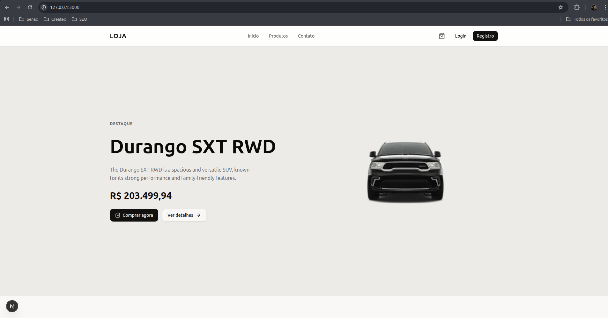
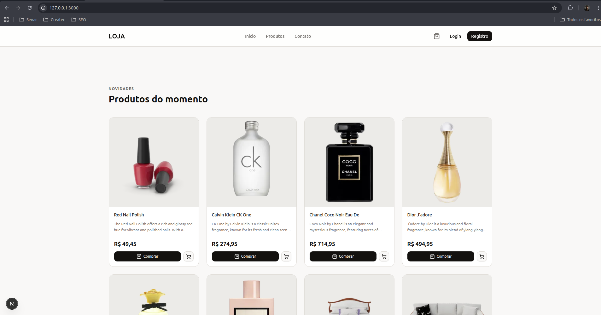

**Requisições ao back-end (em paralelo via `Promise.all`):**
- Busca todos os produtos a partir do ID 4
- Destaca o produto de maior preço
- Exibe os produtos mais vendidos (IDs 0 a 4)

**Otimizações:** cache de 1 hora · renderização pelo servidor (SSR)

---

#### `/produtos` — Listagem de produtos

Grid completo de produtos com suporte a categorias, busca por nome e ordenação por nome ou preço.

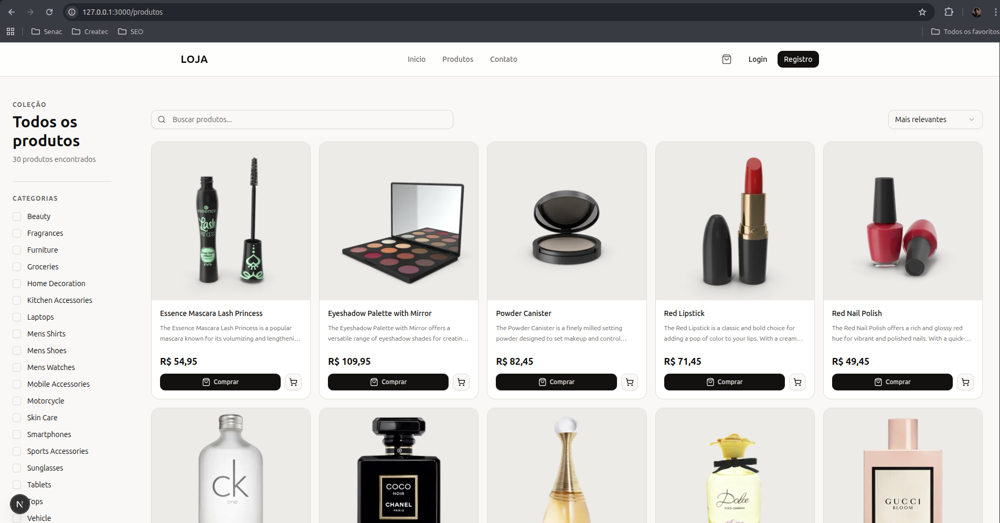

**Requisições ao back-end (em paralelo via `Promise.all`):**
- Busca todos os produtos
- Busca todas as categorias
- Filtra por categoria (requisição ao back-end ao selecionar)

**Otimizações:** cache de 1 hora

---

#### `/produtos/{nome}/{id}` — Detalhes do produto

Página individual de um produto.

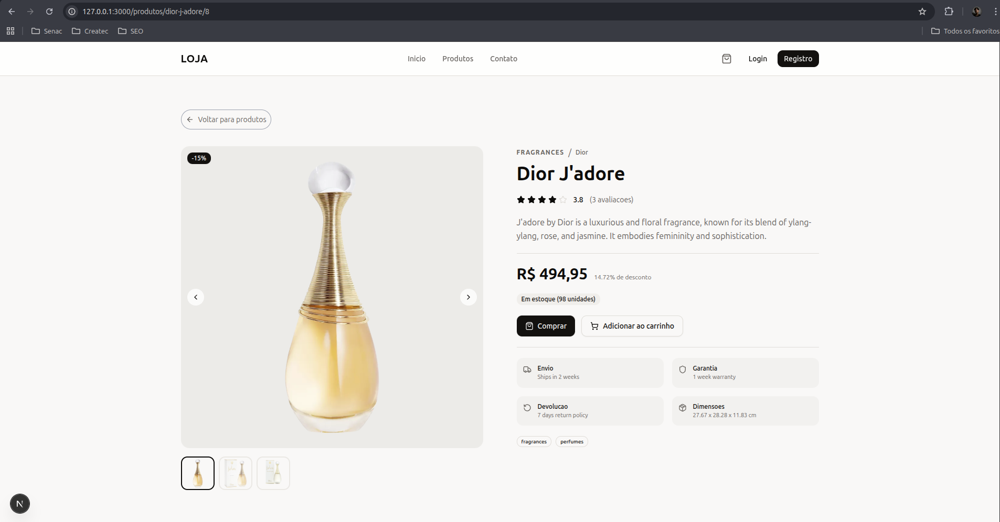

"Caso o produto não seja encontrado, ele retorna :
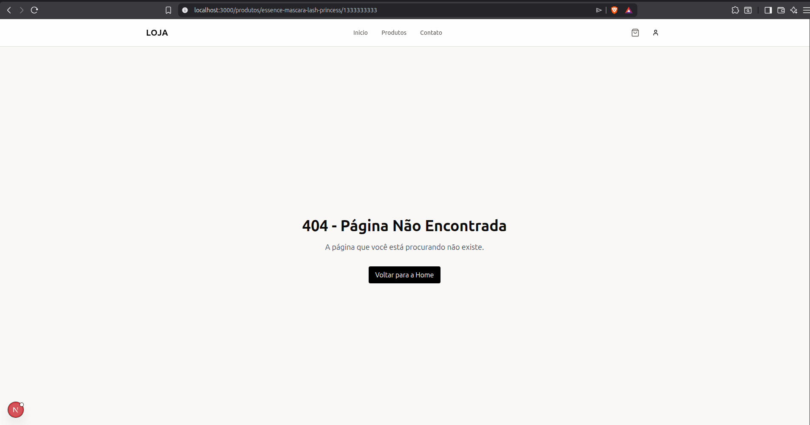
---

#### `/login` — Login

Formulário de autenticação do usuário.

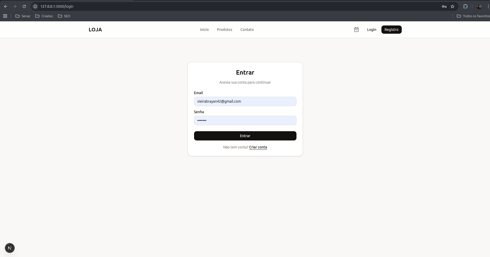

- Validação dos campos no front-end antes de enviar ao back-end
- Token armazenado via cookie `httpOnly` através de uma função `use server`, eliminando vulnerabilidades de roubo de token por XSS
- Middleware redireciona usuários já autenticados para `/`

---

#### `/registro` — Cadastro

Formulário de criação de conta.

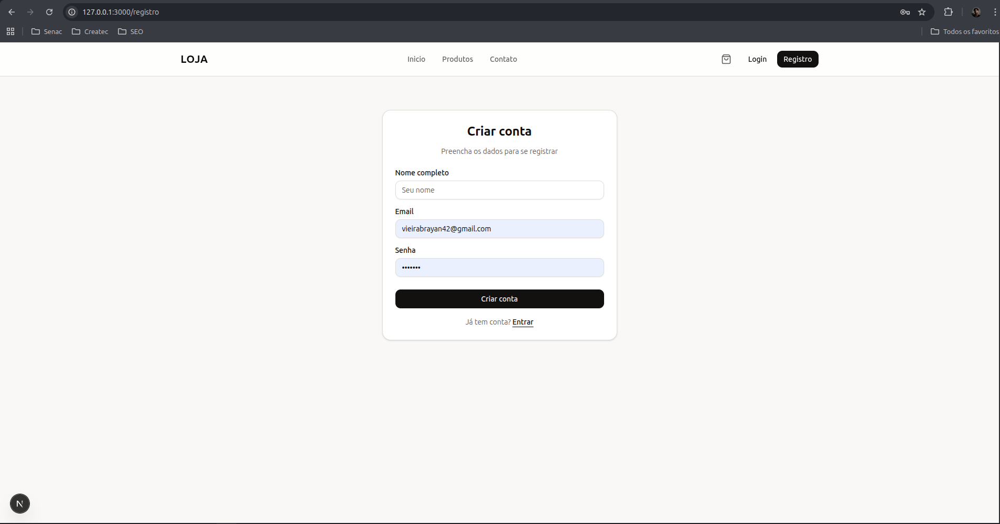

- Validação e tratamento de erros no front-end
- Token armazenado via `httpOnly` ao registrar com sucesso

---

#### `/conta/perfil` — Perfil do usuário

Exibe as informações cadastradas e o histórico de pedidos do usuário.

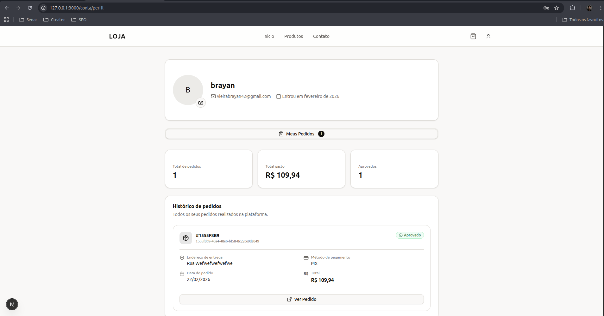

- Renderização pelo servidor (SSR)
- Cache de 1 hora

---

#### `/conta/pedido/{uuid}` — Detalhes do pedido

Exibe todos os itens de um pedido específico, incluindo nome, imagem e valor unitário de cada produto.

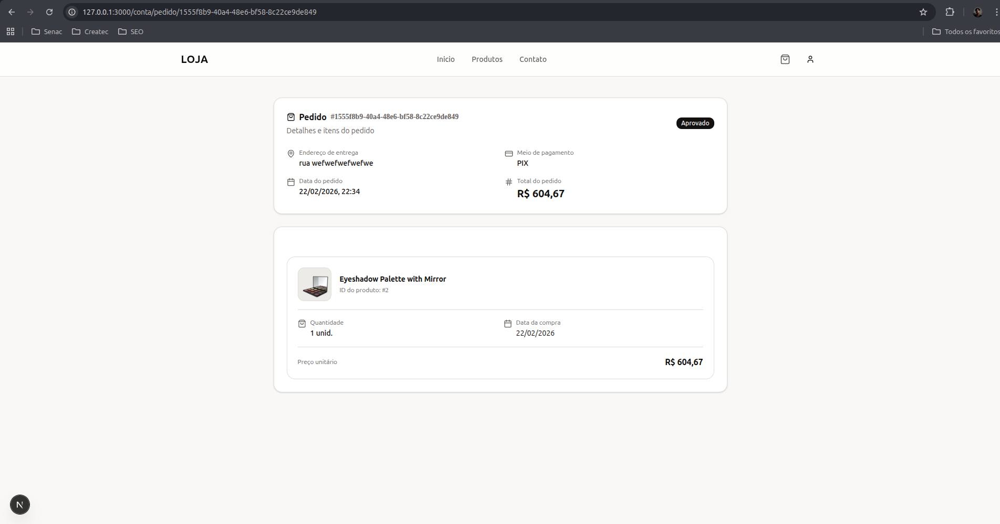

- UUIDs utilizados no lugar de IDs sequenciais para reduzir a previsibilidade e dificultar ataques de enumeração
- Renderização pelo servidor (SSR)

Caso não encontre, retorna :
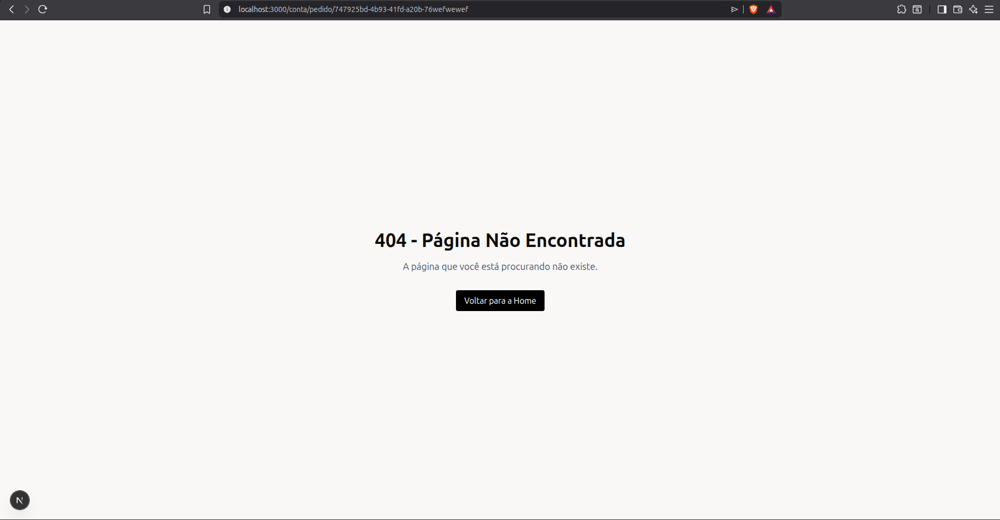
---

#### `/checkout` — Carrinho e finalização de compra

Exibe todos os itens do carrinho, solicita o endereço de entrega e o meio de pagamento, dividido em etapas.

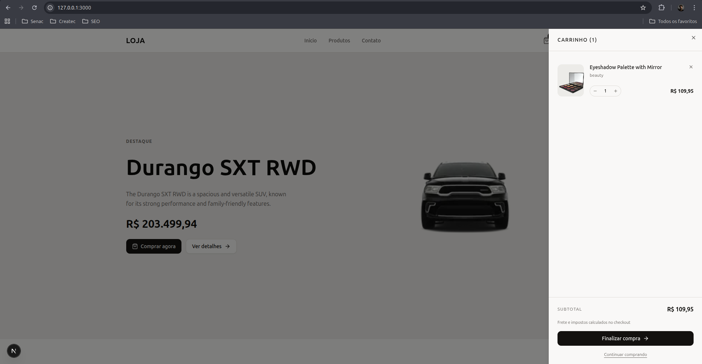
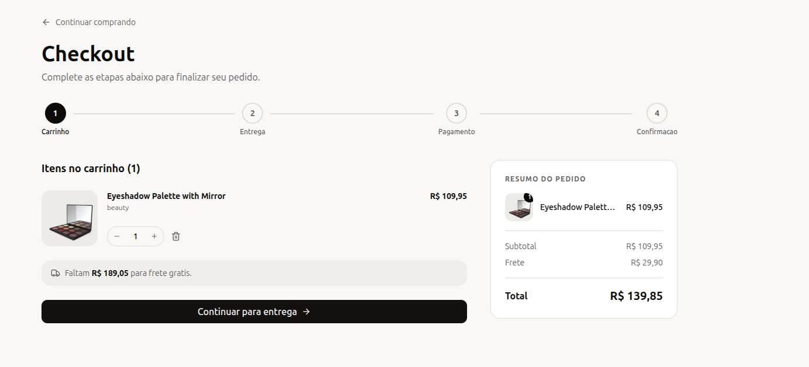
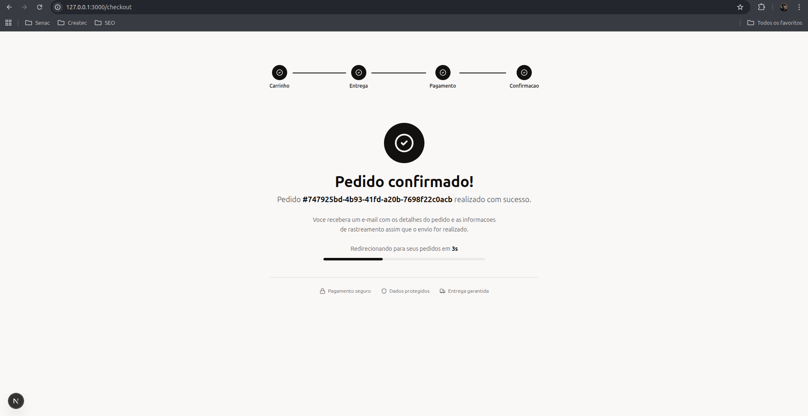

- Carrinho persistido via cookie `carrinho_itens` no formato JSON
- Dados do pedido enviados ao back-end através de uma função `use server`
- Retorna o `uuid` do pedido criado ao finalizar a compra

**Estrutura do cookie `carrinho_itens`:**

```json
[
  {
    "produto": {
      "id": 2,
      "nome": "Eyeshadow Palette with Mirror",
      "slug": "eyeshadow-palette-with-mirror",
      "descricao": "The Eyeshadow Palette with Mirror offers a versatile range...",
      "preco": "109.95",
      "imagem": "https://cdn.dummyjson.com/product-images/beauty/eyeshadow-palette-with-mirror/thumbnail.webp",
      "categoria": "beauty",
      "destaque": false
    },
    "quantidade": 1
  }
]
```

---

## 🔧 Back-End

### Estrutura de pastas

```
/Controllers   → Lógica de negócio (cadastro, busca etc.)
/Routes        → Definição de cada rota da API
/Models        → Definição das tabelas do banco de dados (Sequelize)
/Middlewares   → Validações de entrada separadas da lógica de negócio
/Cruds         → Funções que executam operações no banco de dados
/Utils         → Funções utilitárias reutilizáveis
```

### Padrão de resposta da API

Todas as respostas seguem o mesmo formato, facilitando o tratamento no front-end:

```json
{
  "msg": "Mensagem descritiva",
  "code": 200
}
```

---

### Rotas

---

#### `GET /products`

Lista produtos com suporte a filtros, ordenação e paginação.

**Query params:**

| Parâmetro | Tipo | Descrição |
|---|---|---|
| `categories` | `string` | Filtra por categoria (3 a 50 caracteres) |
| `order` | `string` | Direção da ordenação: `asc` ou `desc` |
| `sortBy` | `string` | Campo de ordenação: `price` ou `title` |
| `limit` | `number` | Quantidade de produtos retornados (mínimo 1) |
| `start` | `number` | Offset da paginação (mínimo 0) |

**Exemplo de requisição:**

```
GET /products?categories=smartphones&order=desc&sortBy=price&limit=10&start=0
```

**Exemplo de resposta:**

```json
{
  "msg": "Produtos buscados com sucesso",
  "code": 200,
  "produtos": [
    {
      "id": 1,
      "nome": "Essence Mascara Lash Princess",
      "descricao": "The Essence Mascara Lash Princess is a popular mascara...",
      "preco": "R$ 54,95",
      "imagem": "https://cdn.dummyjson.com/product-images/beauty/essence-mascara-lash-princess/thumbnail.webp",
      "estoque": 99
    }
  ]
}
```

---

#### `GET /products/:id`

Retorna os detalhes de um produto específico pelo ID.

**Path params:**

| Parâmetro | Tipo | Descrição |
|---|---|---|
| `id` | `number` | ID numérico do produto (≥ 0) |

**Exemplo de requisição:**

```
GET /products/2
```

**Exemplo de resposta:**

```json
{
  "code": 200,
  "msg": "Produto buscado com sucesso",
  "produto": {
    "id": 2,
    "nome": "Eyeshadow Palette with Mirror",
    "descricao": "The Eyeshadow Palette with Mirror offers a versatile range...",
    "categoria": "beauty",
    "preco": "R$ 109,95",
    "desconto": "18.19%",
    "avaliacaoNota": "2.86 / 5",
    "estoque": 34,
    "tags": ["beauty"],
    "marca": "Glamour Beauty",
    "sku": "BEA-GLA-EYE-002",
    "peso": 9,
    "dimensoes": {
      "width": 9.26,
      "height": 22.47,
      "depth": 27.67
    },
    "informacaoGarantia": "1 year warranty",
    "informacaoEnvio": "Ships in 2 weeks",
    "statusDisponibilidade": "In Stock",
    "avaliacoes": [
      {
        "nota": 5,
        "nome": "Savannah Gomez",
        "comentario": "Great product!",
        "data": "30/04/2025",
        "email": "savannah.gomez@x.dummyjson.com"
      }
    ],
    "politicaRetorno": "7 days return policy",
    "quantidadeMinimaPedido": 20,
    "imagens": [
      "https://cdn.dummyjson.com/product-images/beauty/eyeshadow-palette-with-mirror/1.webp"
    ],
    "thumbnail": "https://cdn.dummyjson.com/product-images/beauty/eyeshadow-palette-with-mirror/thumbnail.webp"
  }
}
```

---

#### `POST /auth/login`

Autentica um usuário e retorna um token JWT.

**Body:**

| Parâmetro | Tipo | Descrição |
|---|---|---|
| `email` | `string` | E-mail válido do usuário |
| `password` | `string` | Senha do usuário (mínimo 6 caracteres) |

**Validações:**
- E-mail obrigatório e com formato válido
- Senha obrigatória com no mínimo 6 caracteres
- Verificação da existência do usuário pelo e-mail
- Comparação da senha com o hash armazenado via Argon2

**Exemplo de requisição:**

```json
POST /auth/login

{
  "email": "usuario@email.com",
  "password": "123456"
}
```

**Exemplo de resposta:**

```json
{
  "msg": "Login realizado com sucesso",
  "code": 200,
  "token": "eyJhbGciOiJIUzI1NiIsInR5cCI6IkpXVCJ9..."
}
```

---

#### `POST /auth/register`

Cadastra um novo usuário e retorna um token JWT.

**Body:**

| Parâmetro | Tipo | Descrição |
|---|---|---|
| `name` | `string` | Nome do usuário (2 a 60 caracteres) |
| `email` | `string` | E-mail válido do usuário |
| `password` | `string` | Senha do usuário (mínimo 6 caracteres) |

**Validações:**
- Nome obrigatório entre 2 e 60 caracteres
- E-mail obrigatório e com formato válido
- Senha obrigatória com no mínimo 6 caracteres
- Verificação de e-mail duplicado

**Exemplo de requisição:**

```json
POST /auth/register

{
  "name": "Brayan Vieira",
  "email": "usuario@email.com",
  "password": "123456"
}
```

**Exemplo de resposta:**

```json
{
  "msg": "Usuário cadastrado com sucesso",
  "code": 201,
  "token": "eyJhbGciOiJIUzI1NiIsInR5cCI6IkpXVCJ9..."
}
```

---

#### `GET /users/`

Retorna os dados do usuário autenticado e seus pedidos.

> 🔒 Requer autenticação via token JWT no header `Authorization: Bearer {token}`

**Exemplo de resposta:**

```json
{
  "msg": "Perfil encontrado com sucesso",
  "code": 200,
  "userInfo": {
    "name": "brayan",
    "email": "vieirabrayan42@gmail.com",
    "created_at": "2026-02-23T01:28:53.000Z",
    "UserOrders": [
      {
        "uuid": "1555f8b9-40a4-48e6-bf58-8c22ce9de849",
        "address": "rua exemplo",
        "payment_method": "pix",
        "amount": "109.94",
        "status": "approved",
        "created_at": "2026-02-23T01:34:04.000Z"
      }
    ]
  }
}
```

---

#### `POST /users/orders`

Cria um novo pedido para o usuário autenticado.

> 🔒 Requer autenticação via token JWT no header `Authorization: Bearer {token}`

**Body:**

| Parâmetro | Tipo | Descrição |
|---|---|---|
| `endereco` | `string` | Endereço de entrega do cliente |
| `pagamento` | `string` | Método de pagamento: `pix`, `cartao` ou `boleto` |
| `produtos` | `array` | Lista de produtos do pedido |

**Estrutura de cada item em `produtos`:**

| Campo | Tipo | Descrição |
|---|---|---|
| `id` | `number` | ID do produto |
| `quantidade` | `number` | Quantidade do produto |

**Comportamento:**
- Para cada item enviado, o sistema consulta a API de produtos e obtém o preço atual diretamente da fonte — os valores enviados pelo cliente nunca são utilizados
- O valor total do pedido é calculado internamente com base nos dados reais da API
- Após validação, o pedido é salvo e um UUID é gerado para identificação

**Exemplo de requisição:**

```json
POST /users/orders

{
  "endereco": "Rua Juscelino, 393 — Uberlândia, MG",
  "pagamento": "pix",
  "produtos": [
    { "id": 2, "quantidade": 2 },
    { "id": 4, "quantidade": 1 }
  ]
}
```

---

#### `GET /users/orders/:uuid`

Retorna os detalhes de um pedido específico do usuário autenticado.

> 🔒 Requer autenticação via token JWT no header `Authorization: Bearer {token}`

**Path params:**

| Parâmetro | Tipo | Descrição |
|---|---|---|
| `uuid` | `string` | Identificador único do pedido |

**Segurança:** a busca filtra simultaneamente pelo `uuid` do pedido **e** pelo `id` do usuário autenticado, prevenindo vulnerabilidades de **IDOR** (Insecure Direct Object Reference), onde um usuário poderia acessar pedidos de terceiros.

**Exemplo de requisição:**

```
GET /users/orders/1555f8b9-40a4-48e6-bf58-8c22ce9de849
Authorization: Bearer {token}
```

**Exemplo de resposta:**

```json
{
  "msg": "Pedido encontrado com sucesso",
  "code": 200,
  "pedidos": {
    "uuid": "1555f8b9-40a4-48e6-bf58-8c22ce9de849",
    "address": "rua exemplo",
    "payment_method": "pix",
    "amount": "R$ 604,67",
    "status": "approved",
    "created_at": "2026-02-23T01:34:04.000Z",
    "OrderItems": [
      {
        "id": 1,
        "name": "Eyeshadow Palette with Mirror",
        "image": "https://cdn.dummyjson.com/product-images/beauty/eyeshadow-palette-with-mirror/thumbnail.webp",
        "price": "R$ 604,67",
        "quantity": 1,
        "product_id": 2,
        "created_at": "2026-02-23T01:34:04.000Z"
      }
    ]
  }
}
```

---

<div align="center">
  Desenvolvido por <strong>Brayan Vieira</strong>
</div>
